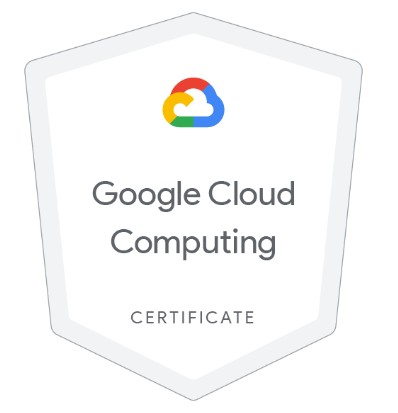
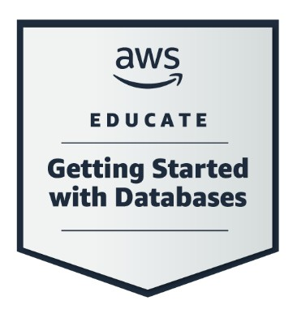

<h1> Jéssica Farias</h1>

 
💻 Engenheira de Dados | 🌍 A passionate data analyst from Brazil | 💻 Data Engineer 

## Resumo Profissional

Engenheira de Dados com 6 anos de experiência em tecnologia da informação, sendo 4 anos dedicados à engenharia e arquitetura de dados em ambientes corporativos de grande porte, como a 
Petrobras. Especialista em modelagem relacional e dimensional, desenvolvimento de processos ETL, automação de pipelines e otimização de performance com uso avançado de PL/SQL, T-SQL e Python. 
Sólida atuação em projetos de migração, integração e governança de dados, com entregas que geraram até 80% de redução de custos e 70% de ganho em eficiência operacional. 

Experiência prática com ferramentas e tecnologias como Oracle, SQL Server, PostgreSQL, Pentaho, Airflow, Spark, BigQuery e Cloud Composer. Forte domínio de soluções em nuvem (GCP e AWS) e visualização de dados com Power BI e Looker Studio. 

Perfil colaborativo, com visão analítica e foco em resultados, além de experiência docente em disciplinas técnicas como Programação Web, Processamento de Imagens e Reconhecimento de Padrões. Busca constante por inovação e boas práticas em engenharia de dados, com interesse em atuar em times multidisciplinares, data-driven e voltados para soluções escaláveis e de alto impacto.

## Formação Acadêmica

- **Bacharel em Sistemas de Informação** | Universidade Federal de Viçosa, 2016
- **Mestre em Ciência da Computação** | Universidade Federal de Uberlândia, 2019
- **MBA em Engenharia e Ciência de Dados** | UNIESP João Pessoa, 2024 (em andamento)

## Projetos Recentes
-  [Data Warehouse – Análise de Acidentes de Trânsito no Brasil](https://github.com/jessdivaloper/analise_dados_UNIESP_MBA):
   - Pentaho Data Integration
   - Python - Pandas
   - PostgreSQL
   - Power BI
-  [Data Warehouse – ETL e Comissionamento para Marketplace em Google Cloud Platform](https://github.com/jessdivaloper/marketplace-data-analysis):
   - Google Cloud Platform (GCP) - BigQuery, Cloud Storage, Cloud Composer, Looker Studio
   - Python
   - PySpark
   - Airflow
 
 -  [EduTrack - Pipeline de Monitoramento de Engajamento de Alunos com o Databricks](https://github.com/jessdivaloper/edutrack):
    - PySpark
    - Databricks
    - Delta Lake
    - Unity Catalog
    - ETL
    - Modelagem Dimensional (Star Schema)
    - Schema Evolution
    - SQL 
    - Python

## Habilidades Técnicas

- **Bancos de Dados**: SQL, PL/SQL, T-SQL, Oracle, PostgreSQL, SQL Server
- **Ferramentas de Nuvem**: GCP (BigQuery, Cloud Composer, DataFlow, Looker Studio, Clod Storage), AWS(Redshift)
- **Orquestração de Tarefas**: Airflow
- **Linguagens**: Python
- **Outras Ferramentas**: Docker, Git, Pandas, Numpy, PySpark, Spark

## Idiomas

- Português: Fluente
- Inglês: Intermediário (B2)

## Badges
Credly Badges:  https://www.credly.com/users/jessica-farias.72b4f2f6

## 📫 Contato
**jessicanaiara.sistemas@gmail.com**

  
